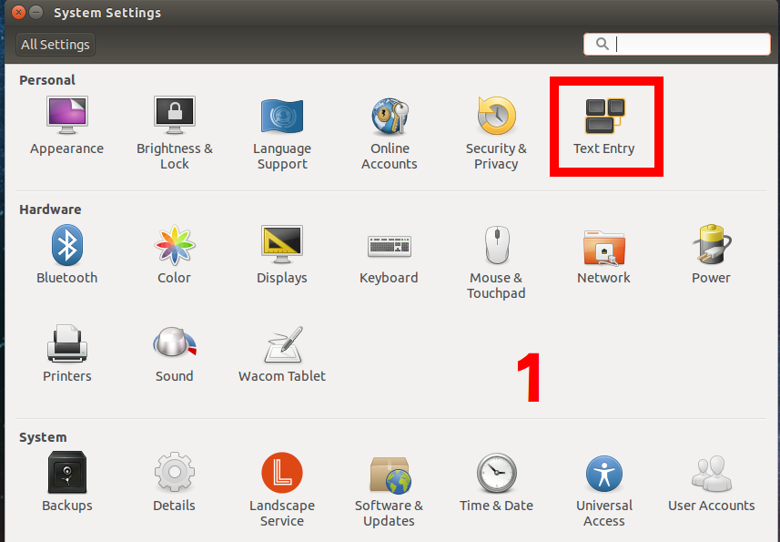
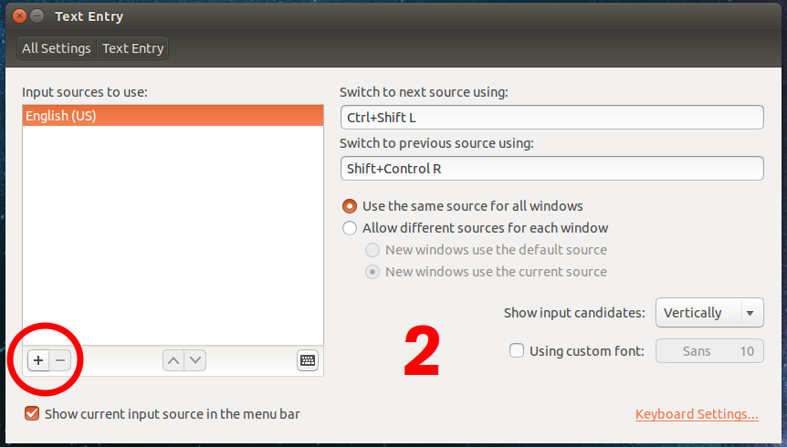
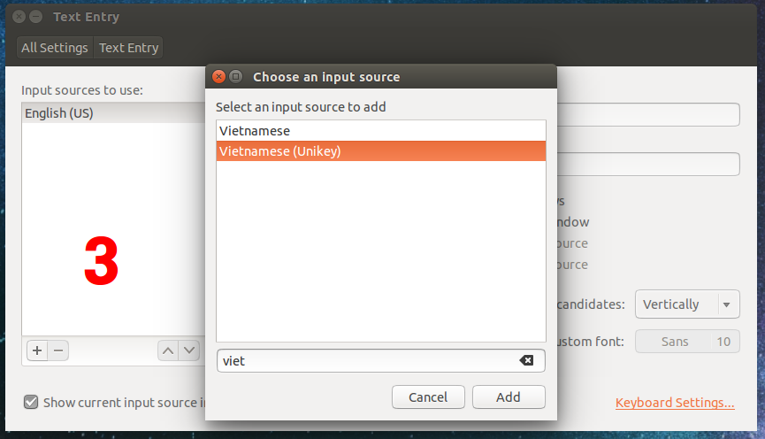

# SETTING

## Contents

* [Editor - Vim](#editor---vim)
* [Bash prompt](#bash-prompt)
* [Editor - VS Code](#editor---vs-code)
* [ibus unikey](#ibus-unikey)
* [git - Install latest version](#git---install-latest-version)

## Editor - Vim

Create `~/.vimrc` if the file hasn't existed yet.

``` shell
$ touch ~/.vimrc
```

Set tab space, auto indent, show line number.

``` bash
" Only do this part when compiled with support for autocommands.
if has("autocmd")
    " Use filetype detection and file-based automatic indenting.
    filetype plugin indent on

    " Use actual tab chars in Makefiles.
    autocmd FileType make set tabstop=8 shiftwidth=8 softtabstop=0 noexpandtab
endif

" For everything else, use a tab width of 4 space chars.
set tabstop=4       " The width of a TAB is set to 4.
                    " Still it is a \t. It is just that
                    " Vim will interpret it to be having
                    " a width of 4.
set shiftwidth=4    " Indents will have a width of 4.
set softtabstop=4   " Sets the number of columns for a TAB.
set expandtab       " Expand TABs to spaces.
set autoindent
set linenumber
```

## Bash prompt
You can use bashpromt generator like [bashrcgenerator.com](http://bashrcgenerator.com/) to get your desired setting for PS1.

**Disclaimer**: I found a bug of this project on 2021 Jan 18, but I haven't found source code of it to fix it. The tool does not generate script to **bold** your `hostname`, you should add it by yourself.

You can refer the way that I implemented successfully for my machine.
* Open `~/.bashrc` and comment below lines

``` bash
if [ "$color_prompt" = yes ]; then
    PS1='${debian_chroot:+($debian_chroot)}\[\033[01;32m\]\u@\h\[\033[00m\]:\[\033[01;34m\]\w\[\033[00m\]\$ '
else
    PS1='${debian_chroot:+($debian_chroot)}\u@\h:\w\$ '
fi
```

* Then replace that block with 

``` bash
PS1="\${debian_chroot:+($debian_chroot)}\[\033[01;32m\]\[\033[38;5;10m\]\u\[$(tput sgr0)\]\[$(tput bold)\]@\[$(tput sgr0)\]\[\033[01;32m\]\[\033[38;5;10m\]\h\[$(tput sgr0)\]:\[\033[01;34m\]\W\[\033[00m\]\$ "
```

## Editor - VS Code

* My favourite setting
  * Show whitespace character
    * Open `Setting`.
    * Type `whitespace` in search bar.
  * Turn on/off minimap
  * (updating...)
* My favourite extension
  * git
  * markdown
  * Text marker (Highlight text)
  * (updating...)
  
## ibus unikey

### Install 

``` shell
$ sudo apt-get instal ibus-unikey
$ ibus restart
```

### Config to type Vietnames







## git - Install latest version

``` shell
$ sudo add-apt-repository ppa:git-core/ppa  
$ sudo apt update  
$ sudo apt install git
```
